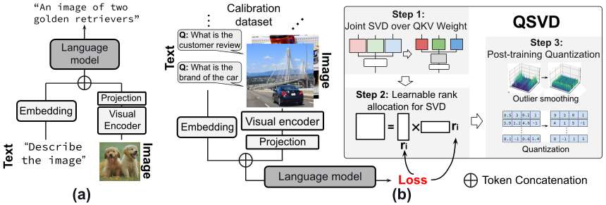

# QSVD: Efficient Low-Rank Approximation for Unified Query-Key-Value Weight Compression in Low-Precision Vision-Language Models

This repository provides the official implementation of **QSVD**, a method for efficient low-rank approximation that unifies Query-Key-Value (QKV) weight compression in low-precision Vision-Language Models (VLMs).



## 🌟 Highlights

- **🧩 Joint QKV Decomposition:**  
  QSVD performs a *joint singular value decomposition* on the concatenated query–key–value weight matrices  $[W_q, W_k, W_v]$, sharing a common down-projection $W_{qkv}^{d}$.  
  → Reduces parameters, low-rank KV-cache, and FLOPs compared to per-matrix SVD.

- **📊 Cross-Layer Rank Allocation:**  
  Introduces an *adaptive cross-layer rank allocation strategy* to allocate ranks across all layers based on each singular value’s contribution to model loss, enabling fine-grained, gradient-guided truncation.  
  → Preserves critical components while truncating redundant ones across all layers.

- **🎯 Post-Training Quantization for Low-Rank VLMs:**  
  Combines *dual orthogonal rotations* $(H_1, \ H_2)$ to smooth channel-wise outliers in both activations and latent buffers, together with an *adaptive exponent β* that rescales singular values to balance channel distributions and reduce quantization error.  
  → Jointly suppresses activation variance and outlier amplification, enabling stable low-precision inference with minimal degradation.


## 🔧 Requirements

This implementation utilize the [myllava](myllava) repository, adapted from the original [LLaVA repo](https://github.com/haotian-liu/LLaVA). Please follow the steps below to set up the environment:

```bash
git submodule update --init --recursive
conda create -n QSVD python=3.10 -y
conda activate QSVD
pip install torch==2.6.0 torchvision==0.21.0 torchaudio==2.6.0 --index-url https://download.pytorch.org/whl/cu126
pip install --no-build-isolation -r requirements.txt
```

<!-- > ⚠️ Note: Ensure the QSVD components and any relevant QuaRot setup are reinstalled correctly. -->

## 📊 Evaluation

To evaluate QSVD and reproduce our results, follow the steps below.

### 📁 Dataset Preparation

Follow the [LLaVA evaluation guide](https://github.com/haotian-liu/LLaVA/blob/main/docs/Evaluation.md) to prepare the following datasets:
- **ScienceQA** (Train) [LLaVA ScienceQA train](myllava/docs/QSVD_DATA.md)
- **VizWiz** (Test)

Update the paths in `eval_*.py` and `data_utils.py` accordingly.

### 🛠 Evaluation Toolkit

We use [third_party/VLMEvalKit](https://github.com/open-compass/VLMEvalKit/blob/main/docs/en/Quickstart.md) for evaluation. Please follow its Quickstart for environment setup and usage.

### ▶️ Running Evaluations

We provide **pre-computed calibration cache files** to directly reproduce the main QSVD results  without rerunning the whitening data and gradient collection. All pre-computed cache files are organized under the [`cache_file`](cache_file) directory.

Each cache package includes:
- **Activation-aware whitening data** for ASVD-style preprocessing, computed from 256 calibration samples.  
- **Gradient-square expectations** of all singular values, estimated on the same dataset. 
- **Final importance scores** used for cross-layer rank allocation in the joint QKV SVD.

Currently supported models:
> [**SmolVLM-Instruct 2B**](cache_file/smolvlm)   
> [**LLaVA-Next 7B**](cache_file/llava-next-7b)  
> [**LLaVA-Next 13B**](cache_file/llava-next-13b)

To reproduce our main results with the provided cache files, you can directly run the following example for **LLaVA-Next 7B**:

```bash
export HF_HOME='your_hf_home'
cd path_to_QSVD/fake_quant
conda activate QSVD
bash path_to_QSVD/scripts/fp16_cache_llavanext.sh 0.9
```

This script will automatically:

1. Load the pre-computed calibration cache from [`cache_file/llava-next-7b`](cache_file/llava-next-7b).  
2. Apply the joint QKV SVD using the stored whitening data, and adaptively truncate singular values based on the pre-computed importance scores and rank budgets.  
3. Evaluate the compressed model under the default **R₁ = 60 % / R₂ = 22.5 %** configuration.

> 💡 **Note:**  
> The argument `0.9` in the command specifies the **rank budget ratio** used for joint QKV SVD.  
> After decomposition, the overall preserved rank is approximately **0.9 / 2 = 0.45**, meaning that about **45 %** of the original rank is retained (dividing by 2 is a legacy setting in the current script).   
> This configuration corresponds to **R₁ = 60 % / R₂ = 22.5 %** in our paper.  
>
> Similarly, using `0.8` results in an effective ratio of **0.8 / 2 = 0.4**, i.e., retaining **40 %** of the rank, which corresponds to **R₁ = 53.33 % / R₂ = 20.0 %**.  
>
>The mapping between **rank ratio → (R₁, R₂)** follows directly from  the definition of joint QKV SVD in QSVD.
>
> You can dynamically adjust this parameter (`0.9`, `0.8`, etc.) to control the effective **rank budget**, balancing the trade-off between compression ratio and accuracy.

For **LLaVA-Next 13B**, modify the script [`scripts/fp16_cache_llavanext.sh`](scripts/fp16_cache_llavanext.sh):
- Set the cache path to:
  ```bash
  cache_file="../cache_file/llava-next-13b"
  ```
- Change the model argument to::
  ```bash
  --model llava-hf/llava-v1.6-vicuna-13b-hf
  ```
- Then run the same command:
  ```bash
  bash path_to_QSVD/scripts/fp16_cache_llavanext.sh 0.9
  ```

For **SmolVLM-Instruct 2B**, use the corresponding script:

```bash
bash path_to_QSVD/scripts/fp16_cache_smolvlm.sh 1.5
```

Similarly, the argument `1.5` here specifies a rank budget ratio corresponding to an effective 75 % retained rank, which maps to **R₁ = 100 % / R₂ = 50 %** in our joint-SVD configuration.

For more usage and custom evaluations, explore the instructions and scripts in [fake_quant](fake_quant/README.md):

## 🤝 Contributing

This project builds upon the excellent work of:
- [QuaRot](https://github.com/spcl/QuaRot)
- [ASVD](https://github.com/hahnyuan/ASVD4LLM)
- [SVDLLM](https://github.com/AIoT-MLSys-Lab/SVD-LLM)

We thank these projects for their contributions to the community.
